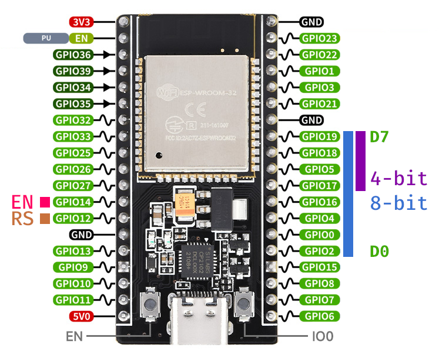

# ESP32 `no_std` Examples

To run any example, pass the example name (`src/bin/<name>.rs`) to espflash:

```rs
cargo espflash flash --monitor --release --bin <name>
```

For the 4-pin and 8-pin examples, the used pins overlap with those used for flashing. You will need to at least disconnect the 5V supply from the LCD display before flashing works. This was done for convenience, such that all 8 pins are physically in one row.

## Pinout for ESP32 NodeMCU-32S



For the I2C examples, GPIO pins 21 (SDA) and 22 (SCL) were used.
If you would rather use a different configuration, make sure to update the example code accordingly.

[→ to the full pinout of this development board](https://www.waveshare.com/nodemcu-32s.htm)
